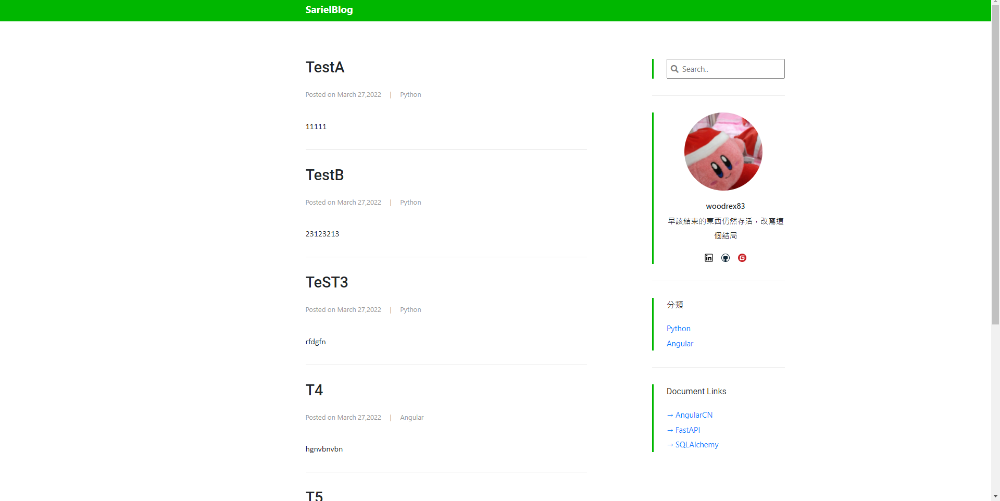
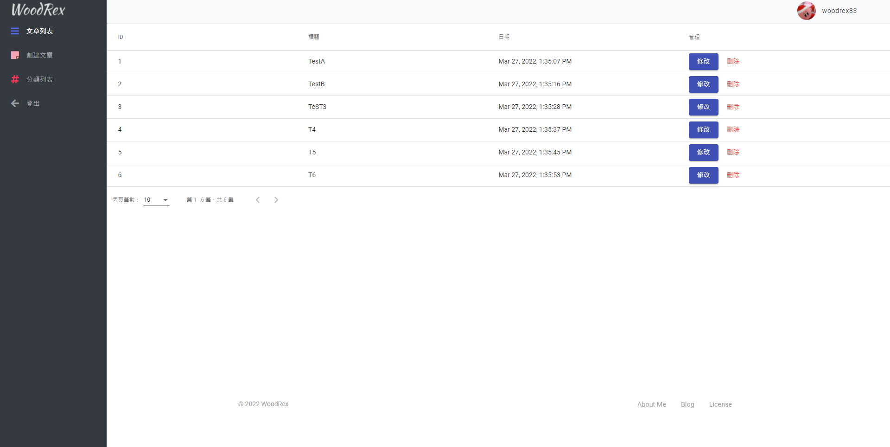

# fastapi-angular-blog

[](https://www.python.org/downloads)
[](https://fastapi.tiangolo.com/)
[](https://angular.cn/)

PS: Not in Maintenance

## Introduction
Python Backend Simple Blog

*Backend*
* FastAPI
* Sqlib3
* ORM：SQLAlchemy

*Frontend*
* Angular
* ngx-bootstrap
* @angular/material

### Requirements
* Python: 3.8.x
* Node: 16.13.0 (LTS)
* Angular CLI: 13.x


```shell
git clone https://gitee.com/Woodrex/fastapi-angular-blog.git
```

### Installation
*Backend*
```
1: Install Python 3.8+ and Open venv
2: Get in /backend
3: pip install -r ./requirements.txt
```

*Frontend*
```
1: Install node and angular-cli
```

### Dev Start

*Backend*
```
# Init
1: cd fastapi-angular-blog
2: backend\venv\scripts\activate.bat
3: uvicorn backend.main:app --port 8003
```

*Frontend*
```
1: cd fastapi-angular-blog
2: npm -i
3: npm start
4: http://localhost:4200        
4: http://localhost:4200/login 
```

## Preview



